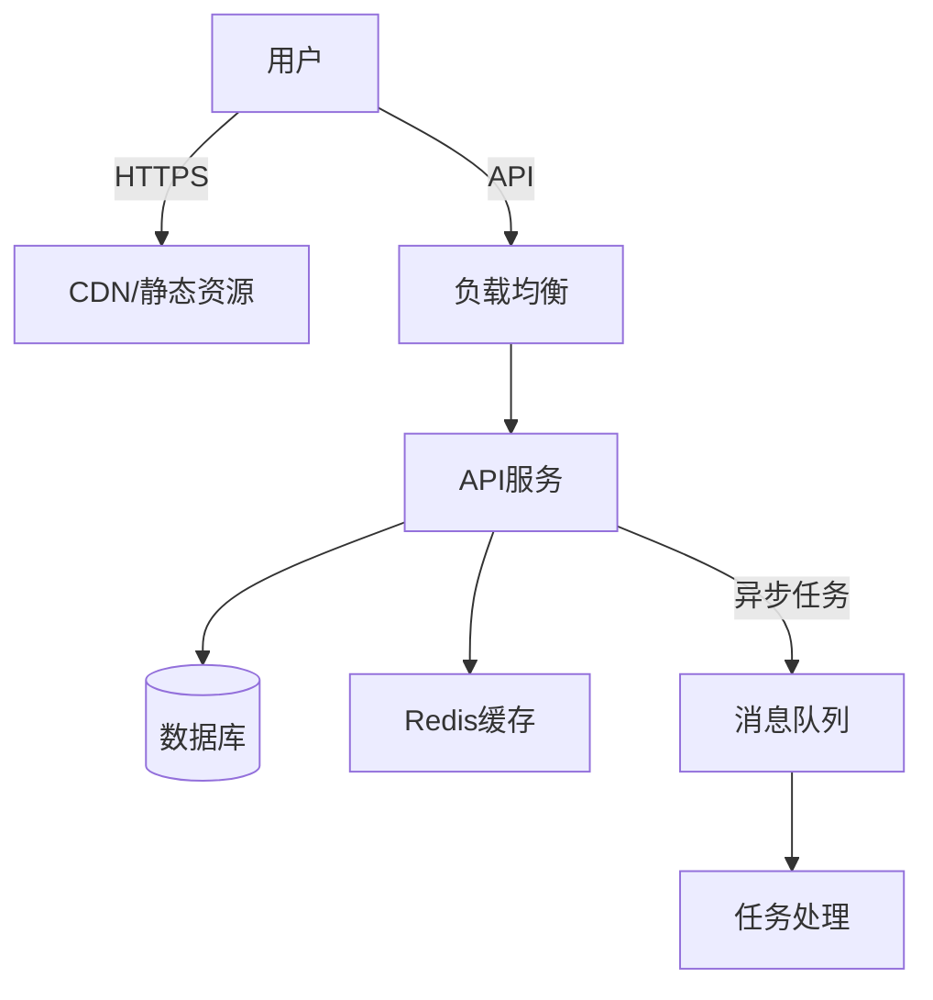

# 架构设计 Skill

快速产出可落地的技术架构方案，不追求完美，追求当下最合适。

## 核心原则

1. **够用即可**：不过度设计，MVP优先
2. **可扩展**：预留未来3-6个月的扩展空间
3. **可落地**：每个决策有明确理由，能说服团队

## 快速设计流程（5分钟出方案）

### Step 1: 需求澄清（1分钟）

**方式A：快速提问**（适合需求明确）

如果用户只说"帮我设计XX系统的架构"，问3个关键问题：

1. **规模预期**：日活/数据量大概多少？（百级/千级/万级/百万级）
2. **团队背景**：现有技术栈是什么？团队熟悉什么语言？
3. **时间约束**：多久要上线？（1周/1个月/3个月）

**方式B：深度问卷**（推荐，适合需求尚不清晰）

如果用户希望系统性梳理需求，**使用 requirement-gathering skill**：
1. 生成架构设计问卷 `requirements-v1.0.md`
2. 用户填写后，读取问卷内容
3. 基于问卷结果继续设计

### Step 2: 一键输出架构方案（3分钟）

直接输出以下文档（不询问，直接给建议）：

```markdown
## 架构方案：{系统名称}

### 1. 技术选型（一句话理由）

| 层级 | 选型 | 理由 |
|-----|------|------|
| 前端 | React/Vue/小程序 | 团队熟悉 + 生态成熟 |
| 后端 | Node/Python/Go | 开发速度 + 性能需求 |
| 数据库 | PostgreSQL/MySQL/Mongo | 关系型优先，除非文档型强需求 |
| 缓存 | Redis | 标配 |
| 部署 | Vercel/Railway/阿里云 | 快速上线 + 成本控制 |

### 2. 系统架构图（Mermaid）



### 3. 核心接口设计（3-5个关键接口）

| 接口 | 方法 | 路径 | 说明 |
|-----|------|------|------|
| 创建XX | POST | /api/v1/xxx | 参数：..., 返回：... |
| 查询XX | GET | /api/v1/xxx/:id | 返回：... |
| 列表XX | GET | /api/v1/xxx?page=1 | 分页：20条/页 |

### 4. 数据模型（核心表）

```
Table: users
- id: uuid, PK
- username: varchar(50), unique
- email: varchar(100), unique
- created_at: timestamp
- updated_at: timestamp

Table: xxx
- id: uuid, PK
- user_id: uuid, FK → users.id
- status: enum('active', 'inactive')
- ...
```

### 5. 部署架构

```
开发环境：本地 + Docker Compose
测试环境：Vercel Preview / 云服务器
生产环境：Vercel / AWS / 阿里云
CI/CD：GitHub Actions
监控：Sentry + 阿里云监控
```

### 6. 风险与应对

| 风险 | 概率 | 应对方案 |
|-----|------|---------|
| 流量突增 | 中 | 加Redis缓存 + 限流 |
| 数据丢失 | 低 | 每日备份 + 主从复制 |
```

### Step 3: 确认或调整（1分钟）

询问：
- "这个方案是否符合预期？"
- "有哪些地方需要调整？"

根据反馈快速修改。

## 技术选型速查表

### 前端
| 场景 | 推荐 | 备选 |
|-----|------|------|
| Web应用 | React + Tailwind | Vue + Element Plus |
| 管理后台 | React + Ant Design | Vue + Arco Design |
| 小程序 | 原生/Taro | uni-app |
| 移动端H5 | React + Vant | Vue + Vant |

### 后端
| 场景 | 推荐 | 备选 |
|-----|------|------|
| 快速开发 | Node.js + Express/Nest | Python + FastAPI |
| 高并发 | Go + Gin | Java + Spring Boot |
| 数据处理 | Python + Celery | Go + 自研 |

### 数据库
| 场景 | 推荐 | 备注 |
|-----|------|------|
| 默认选择 | PostgreSQL | 功能全、开源免费 |
| 团队熟悉MySQL | MySQL 8.0 | 也行 |
| 文档型数据 | MongoDB | 非结构化数据多 |
| 缓存 | Redis | 标配 |
| 搜索 | Elasticsearch | 复杂搜索场景 |

### 部署
| 场景 | 推荐 | 成本 |
|-----|------|------|
| 快速上线 | Vercel/Railway/Render | 免费-$20/月 |
| 国内部署 | 阿里云/腾讯云 | ¥100-500/月 |
| 全栈容器 | Docker Compose | 服务器成本 |
| 大规模 | Kubernetes | 运维成本高 |

## 常见架构模式

### 模式1：单体应用（推荐MVP）
```
前端 + 后端API + 数据库
部署：单服务器/Docker
适合：团队<5人，日活<1万
```

### 模式2：前后端分离（标准）
```
前端（CDN） → 后端API（多实例） → 数据库（主从）
部署：分离部署，独立扩展
适合：需要并行开发，团队>3人
```

### 模式3：微服务（谨慎选择）
```
网关 → 服务A/服务B/服务C → 各自数据库
适合：团队>20人，多业务线并行
警告：MVP阶段不要用
```

### 模式4：Serverless（快速验证）
```
前端 + 云函数 + 云数据库
适合：不确定需求，快速试错
限制：冷启动、 vendor lock-in
```

## 设计检查清单（自检用）

输出方案后快速检查：

- [ ] 技术选型有明确理由（不是"我觉得好"）
- [ ] 数据模型满足需求（能存下、能查出来）
- [ ] 接口设计符合RESTful（或说明为什么不用）
- [ ] 部署方案能跑起来（不是空中楼阁）
- [ ] 考虑了最明显的一个风险点

## 避免过度设计的信号

以下情况说明你在过度设计：

- ❌ 考虑了百万并发但当前日活<100
- ❌ 引入了消息队列但当前只有同步接口
- ❌ 设计了微服务但团队只有2个人
- ❌ 用了分布式事务但业务允许短暂不一致
- ❌ 为"可能"的需求预留了抽象接口

**对策**：先跑起来，瓶颈出现了再优化。

## 输出示例

用户："我想做一个在线文档协作工具，团队3人，1个月上线"

输出：
```markdown
## 架构方案：在线文档协作

### 技术选型
| 层级 | 选型 | 理由 |
|-----|------|------|
| 前端 | React + Yjs | Yjs是成熟的CRDT库，省掉自研协同算法 |
| 后端 | Node.js + Express | 团队熟悉，Socket.io实时通信 |
| 数据库 | PostgreSQL + Redis | PG存文档快照，Redis存在线状态 |
| 存储 | AWS S3/阿里云OSS | 文档附件存储 |

### 架构要点
1. 实时协同：Yjs CRDT算法，无需后端复杂处理
2. 文档存储：每5分钟存一个快照到PG
3. 权限：简单的Owner/Editor/Viewer三角色
4. 冲突：Yjs自动处理，无需人工介入

### 核心接口
- POST /api/docs - 创建文档
- GET /api/docs/:id - 获取文档
- WebSocket /ws/:docId - 实时协作通道

### 部署
Vercel（前端）+ Railway（后端）+ Supabase（数据库）
预估成本：$30/月
```

## 输出要求

**⚠️ 重要：生成的架构方案必须写入文件！**

### 文件命名规范

**标准格式**：`ARCH-v{主版本号}.{次版本号}.md`

| 场景 | 命名示例 | 说明 |
|-----|---------|------|
| 首次输出 | `ARCH-v1.0.md` | 基础版本 |
| 小迭代更新 | `ARCH-v1.1.md`、`ARCH-v1.2.md` | 细节调整/技术选型变更 |
| 大版本更新 | `ARCH-v2.0.md`、`ARCH-v3.0.md` | 架构重构/重大技术变更 |

### 文件写入要求

1. **写入位置**：当前工作目录或用户指定的目录
2. **操作步骤**：
   - 使用 WriteFile 工具将完整架构方案写入文件
   - 文件写入成功后，向用户展示文件路径和简要概览
   - 告知用户可以在文件中查看完整的架构方案

---

## 快速指令

用户可以这样说：

| 指令 | 响应 |
|-----|------|
| "快速出方案" | 跳过详细解释，直接给方案 |
| "给我3个选项" | 给出技术选型的3个方案对比 |
| "MVP架构" | 极简方案，能跑就行 |
| "扩展性优先" | 预留更多扩展空间的设计 |
