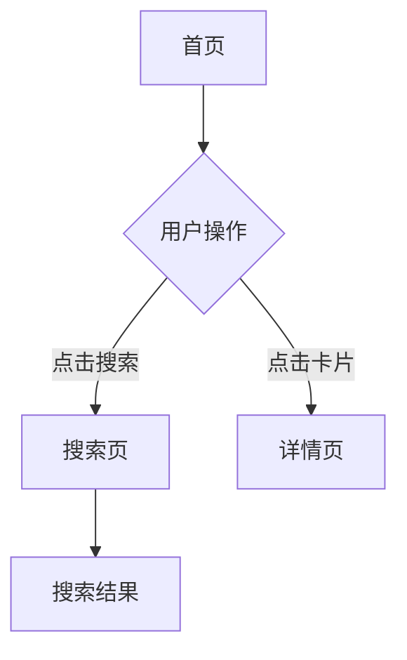

# Product Design Skill

帮助用户将模糊的产品想法转化为清晰的产品方案和可验证的原型。

## 核心能力

1. **需求探索** - 通过提问帮助用户明确产品目标和用户痛点
2. **PRD 撰写** - 输出结构化的产品需求文档
3. **原型设计** - 生成线框图和交互流程
4. **迭代优化** - 根据反馈调整产品方案

## 工作流程

### Step 1: 需求澄清（首次对话时执行）

**方式A：快速提问**（适合需求明确）

如果用户只说"我想做一个XX"，先通过提问澄清：

- 核心问题：这个产品解决什么痛点？目标用户是谁？
- 竞品参考：有没有类似的产品你觉得不错的？
- 功能预期：你最希望优先实现哪3个功能？
- 平台选择：是 App、小程序、Web 还是多平台？

**注意**：只需问最关键的问题，不要一次性问太多。

**方式B：深度问卷**（推荐，适合需求尚不清晰）

如果用户希望系统性梳理需求，**使用 requirement-gathering skill**：
1. 生成产品设计问卷 `requirements-v1.0.md`
2. 用户填写后，读取问卷内容
3. 基于问卷结果继续设计

### Step 2: 产品分析

基于用户输入，输出以下内容：

```markdown
## 产品概述
- 产品名称：
- 一句话描述：
- 目标用户：
- 核心价值主张：

## 用户画像
- 用户A（主要用户）：年龄、职业、使用场景、核心痛点
- 用户B（次要用户）：...

## 功能清单（按优先级）
### P0 - MVP 必备
1. [功能名] - [一句话描述] - [解决什么痛点]
2. ...

### P1 - 重要但不紧急
1. ...

### P2 - 增值功能
1. ...

## 用户旅程地图
[场景] → [用户行为] → [触点] → [情绪曲线] → [机会点]

## 竞品分析（如有）
- 直接竞品：[产品名] - 优点/缺点/我们可以差异化的地方
```

### Step 3: PRD 撰写

**输出要求**：必须生成标准格式的 `PRD-v{版本号}.md` 文件（如 `PRD-v1.0.md`），包含完整的产品需求文档。

为每个 P0 功能撰写详细需求：

```markdown
## [功能名] 需求文档

### 功能概述
- 背景：
- 目标：
- 成功指标：

### 详细需求

#### 入口
- 用户如何进入这个功能？

#### 主流程
1. 步骤一：...
2. 步骤二：...
3. ...

#### 异常流程
- 情况A：...
- 情况B：...

#### 边界情况
- ...

### 页面元素
| 元素 | 类型 | 说明 | 交互 |
|-----|------|-----|------|
| ... | ... | ... | ... |

### 数据需求（如有）
- 需要存储什么数据？
- 数据来源？
```

### Step 4: 原型设计

输出两种形式的原型：

**形式 A：文字线框图（快速验证）**

```
┌─────────────────────────────┐
│  < 返回      页面标题    [设置] │
├─────────────────────────────┤
│                             │
│  ┌───────────────────────┐  │
│  │    [搜索框]           │  │
│  └───────────────────────┘  │
│                             │
│  最近使用                   │
│  ┌──────┐ ┌──────┐ ┌──────┐ │
│  │ 图标 │ │ 图标 │ │ 图标 │ │
│  │ 名称 │ │ 名称 │ │ 名称 │ │
│  └──────┘ └──────┘ └──────┘ │
│                             │
└─────────────────────────────┘
```

**形式 B：Mermaid 流程图（复杂交互）**



**形式 C：HTML 低保真原型（需要时）**

如果用户需要可交互的原型，生成简单的 HTML：

```html
<!DOCTYPE html>
<html>
<head>
  <meta name="viewport" content="width=device-width, initial-scale=1.0">
  <script src="https://cdn.tailwindcss.com"></script>
</head>
<body class="bg-gray-100">
  <!-- 低保真线框 -->
  <div class="max-w-md mx-auto bg-white min-h-screen">
    <!-- 页面结构 -->
  </div>
</body>
</html>
```

**选择原则**：
- 快速验证 → 文字线框图
- 多页面流程 → Mermaid 流程图 + 关键页面线框
- 需要演示 → HTML 低保真原型

### Step 5: 迭代确认

询问用户：
- 这个方案是否符合预期？
- 有什么需要调整的地方？
- 是否需要补充其他功能？

根据反馈循环优化。

## 设计原则

1. **MVP 优先**：引导用户先做最小可用版本，避免功能膨胀
2. **用户视角**：始终以用户场景为出发点，不要陷入功能堆砌
3. **可落地**：每个功能都要有明确的入口、流程和输出
4. **留有余地**：设计时考虑未来的扩展性

## 原型输出规范

### 颜色（线框图）
- 背景：白色/浅灰
- 边框：深灰实线
- 占位符：浅灰填充
- 文字：[文字说明]

### 组件标注
- 按钮：[按钮文字]
- 输入框：[占位符提示]
- 图标：[图标说明]
- 图片：[图片内容描述]

## 常见产品类型提示

### App 原型
- 考虑底部导航栏（Tab Bar）
- 注意手机状态栏和底部安全区
- 考虑 iOS/Android 差异

### Web 原型
- 考虑导航栏、侧边栏布局
- 响应式断点（桌面/平板/手机）
- 顶部通知/公告区域

### 小程序原型
- 遵守平台规范（微信/支付宝）
- 顶部标题栏不可自定义
- 底部 Tab Bar 最多5个

### 后台系统原型
- 左侧菜单树结构
- 顶部面包屑导航
- 列表页+详情页模式
- 筛选/搜索区域

## 工具使用

- 生成 HTML 原型时使用 Tailwind CSS CDN
- 需要流程图时使用 Mermaid 语法
- 复杂交互用文字描述状态变化

## PRD 文件输出规范

### 文件命名
- 文件命名格式：`PRD-v{主版本号}.{次版本号}.md`
- 首次输出：`PRD-v1.0.md`
- 小迭代更新：`PRD-v1.1.md`、`PRD-v1.2.md`
- 大版本更新：`PRD-v2.0.md`、`PRD-v3.0.md`

### 文件结构
`PRD-v1.0.md` 必须包含以下章节：
1. **产品概述** - 产品名称、一句话描述、目标用户、核心价值主张
2. **用户画像** - 主要/次要用户特征
3. **功能清单** - 按 P0/P1/P2 优先级分类
4. **功能详细需求** - 每个 P0 功能的详细文档
5. **原型设计** - 线框图或流程图
6. **数据需求**（如有）
7. **项目排期**（建议）
