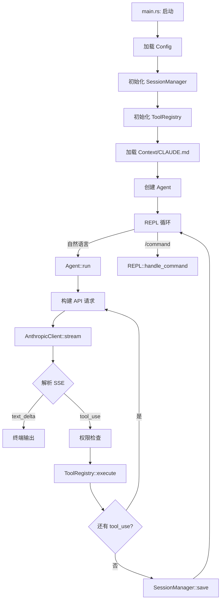

# PRD-v2.0: mini-code 完全重写

## 产品概述

- **产品名称**：mini-code
- **一句话描述**：用 Rust 实现的高性能 CLI 编码助手，对标 Claude Code
- **目标用户**：开发者（初期为个人使用）
- **核心价值主张**：快速、轻量、可扩展的命令行 AI 编程工具

## 用户画像

- **用户A（主要）**：后端/系统开发者，习惯终端工作流，需要 AI 辅助编码但不想离开命令行
  - 核心痛点：现有 Claude Code 性能开销大，且不开源无法定制

## 功能清单

### P0 — MVP 必备（v2.0）

1. **配置管理** — 支持 API key、模型选择、工具权限策略
2. **流式对话** — 实时流式输出 AI 回复，非阻塞等待
3. **会话管理** — 创建/切换/删除/列出会话，持久化消息历史
4. **工具系统** — 可扩展的工具注册、执行、权限控制
5. **REPL 交互** — 命令行 REPL，支持斜杠命令和自然语言输入
6. **系统提示词** — 加载项目级指令文件（CLAUDE.md）

### P1 — 重要但不紧急（v2.1+）

1. **子代理机制** — 独立工作树中执行任务的子代理
2. **MCP 支持** — 模型上下文协议，连接外部工具
3. **记忆系统** — 跨会话持久化用户偏好和项目知识
4. **钩子系统** — 工具执行前后的用户自定义钩子
5. **自动补全** — REPL 中的路径、命令自动补全

### P2 — 增值功能

1. **多模型支持** — OpenAI、本地模型等
2. **插件系统** — 第三方工具和技能扩展
3. **会话分支** — 从任意消息点分支对话

---

## P0 功能详细需求

---

### 1. 配置管理

#### 功能概述
- **背景**：需要持久化 API 密钥、模型偏好、工具权限等配置
- **目标**：首次启动交互式配置，后续从文件加载
- **成功指标**：用户无需手动编辑 TOML 即可完成初始配置

#### 详细需求

**配置文件位置**：`~/.config/mini-code/config.toml`

**配置结构**：
```toml
[api]
api_key = "sk-ant-xxx"
model = "claude-sonnet-4-6"
base_url = "https://api.anthropic.com"
max_tokens = 8192

[permissions]
# "safe" | "confirm" | "deny"
bash = "confirm"
write_file = "confirm"
read_file = "safe"
glob = "safe"
grep = "safe"
list_dir = "safe"
edit_file = "confirm"

[behavior]
auto_save = true
theme = "dark"
```

**入口**：首次运行自动触发配置向导

**主流程**：
1. 检测配置文件是否存在
2. 不存在 → 提示输入 API Key → 写入默认配置
3. 存在 → 直接加载

---

### 2. 流式对话

#### 功能概述
- **背景**：当前实现阻塞等待完整 API 响应，用户体验差
- **目标**：实时输出 AI 回复，支持流式文本 + 工具调用增量解析

#### 架构设计

```
用户输入 → Agent Loop → Anthropic Streaming API
                ↓
         解析 SSE 事件流
                ↓
    ┌──────────┼──────────┐
  text_delta   tool_use   tool_result
    ↓            ↓            ↓
  终端打印    累积参数    提交结果
                ↓
         执行工具 → 继续 Loop
```

**主流程**：
1. 发送请求时设置 `stream: true`
2. 按 SSE 事件类型分发：
   - `content_block_start` → 新内容块开始
   - `content_block_delta` → 增量内容（文本追加 or 工具参数累积）
   - `content_block_stop` → 内容块结束
3. 文本增量直接 print 到终端
4. 工具调用增量累积完整参数后执行
5. 工具结果作为 user message 追加到消息列表，继续下一轮

**异常流程**：
- 网络中断 → 重试一次，失败则提示用户
- API 错误 → 解析 error 字段展示给用户

---

### 3. 会话管理

#### 功能概述
- **背景**：需要持久化对话历史，支持多会话切换
- **目标**：JSON 文件存储，支持 CRUD 操作

**存储位置**：`~/.local/share/mini-code/sessions/<uuid>.json`

**会话结构**：
```json
{
  "id": "uuid",
  "name": "session-name",
  "created_at": "ISO8601",
  "updated_at": "ISO8601",
  "messages": [
    {
      "role": "user",
      "content": [{"type": "text", "text": "Hello"}]
    },
    {
      "role": "assistant",
      "content": [
        {"type": "text", "text": "Hi there"},
        {"type": "tool_use", "id": "tool_001", "name": "read_file", "input": {"path": "/tmp/x"}}
      ]
    },
    {
      "role": "user",
      "content": [{"type": "tool_result", "tool_use_id": "tool_001", "content": "file contents..."}]
    }
  ]
}
```

**消息格式对齐 Anthropic API 原生格式**（关键设计变更）：
- 消息的 `content` 字段直接使用 Anthropic API 的 content block 数组格式
- 不再自定义 Content 枚举序列化，减少转换层
- 存储时就是 API 格式，发送时无需转换

**REPL 命令**：
- `/new <name>` — 创建新会话
- `/sessions` — 列出所有会话
- `/switch <id>` — 切换会话
- `/delete <id>` — 删除会话
- `/rename <name>` — 重命名当前会话
- `/clear` — 清空当前会话消息

---

### 4. 工具系统

#### 功能概述
- **背景**：AI 需要通过工具与文件系统和 shell 交互
- **目标**：可扩展的 trait 体系 + 三级权限控制

#### 架构设计

```rust
/// 工具权限等级
pub enum PermissionLevel {
    Safe,      // 静默执行
    Confirm,   // 需用户确认
    Deny,      // 需要用户手动授权
}

/// 工具 trait
pub trait Tool: Send + Sync {
    fn name(&self) -> &str;
    fn description(&self) -> &str;
    fn schema(&self) -> Value;           // JSON Schema
    fn permission(&self) -> PermissionLevel;
    fn execute(&self, input: Value) -> Result<String>;
}

/// 工具注册表
pub struct ToolRegistry {
    tools: HashMap<String, Box<dyn Tool>>,
    config: PermissionConfig,
}
```

#### P0 工具清单

| 工具名 | 权限 | 功能 | 关键参数 |
|--------|------|------|----------|
| `bash` | confirm | 执行 shell 命令 | command, timeout |
| `read_file` | safe | 读取文件内容 | path, offset?, limit? |
| `write_file` | confirm | 写入文件 | path, content |
| `edit_file` | confirm | 精确字符串替换 | path, old_string, new_string |
| `glob` | safe | 文件模式匹配 | pattern, path? |
| `grep` | safe | 搜索文件内容 | pattern, path?, glob? |
| `list_dir` | safe | 列出目录 | path |

#### 权限执行流程

```
工具调用
  ↓
查询权限配置（用户可在 config 中覆盖）
  ↓
Safe → 直接执行
Confirm → 打印工具详情 → [Y/n] 确认 → 执行
Deny → 打印提示 → 要求用户手动输入 "allow" 才能执行
```

---

### 5. REPL 交互

#### 功能概述
- **背景**：用户通过命令行与 mini-code 交互
- **目标**：支持自然语言对话 + 斜杠命令

**入口**：终端执行 `mini-code`

**状态栏**（启动时显示）：
```
mini-code v2.0.0
当前会话: feature-x (12 条消息)
输入问题或 /help 查看命令

> 
```

**主流程**：
1. 用户输入文本
2. 以 `/` 开头 → 路由到命令处理器
3. 其他 → 进入 Agent 对话循环

**Agent 循环**（核心）：
```
用户输入
  ↓
追加 user message
  ↓
循环（最多 N 轮）：
  ├─ 调用 Anthropic API（streaming）
  ├─ 解析响应 content blocks
  ├─ text → 终端输出
  ├─ tool_use → 权限检查 → 执行 → 收集结果
  └─ 无 tool_use → 结束循环
  ↓
自动保存会话
```

**异常流程**：
- 无活跃会话 → 提示用户 `/new`
- API 调用失败 → 显示错误，保留输入
- 工具执行失败 → 将错误作为 tool_result(is_error=true) 返回给模型
- 达到最大轮数 → 警告并截断

---

### 6. 系统提示词

#### 功能概述
- **背景**：给 AI 提供项目级上下文和行为指令
- **目标**：自动发现并加载 CLAUDE.md 文件

**加载顺序**：
1. 全局（可选）：`~/.config/mini-code/instructions.md`
2. 项目级：从当前目录向上搜索 `CLAUDE.md`
3. 合并为系统提示词，放在消息列表最前

**主流程**：
1. 启动 REPL / 创建会话时加载
2. 将 system prompt 作为 `system` 字段发送给 API
3. 会话中不存储 system prompt（仅发送时附加）

---

## 架构设计

### 模块结构

```
src/
├── main.rs              # 入口，启动逻辑
├── config.rs            # 配置加载/保存
├── repl.rs              # REPL 输入循环
├── agent.rs             # Agent 核心循环（think → act → observe）
├── anthropic.rs         # Anthropic API 客户端（流式）
├── session.rs           # 会话管理
├── context.rs            # 系统提示词加载
├── tools/
│   ├── mod.rs           # Tool trait + ToolRegistry + 权限系统
│   ├── bash.rs
│   ├── read_file.rs
│   ├── write_file.rs
│   ├── edit_file.rs
│   ├── glob.rs
│   ├── grep.rs
│   └── list_dir.rs
└── permissions.rs       # 权限配置与决策
```

### 数据流



### 关键设计决策

1. **消息存储采用 Anthropic API 原生格式**：减少序列化转换层，session JSON 直接存储 API 格式的 content blocks
2. **Agent 与 REPL 分离**：Agent 只管「发消息→收回复→执行工具」循环，REPL 只管 I/O 和命令路由
3. **流式优先**：API 客户端默认流式，通过 channel 传递增量事件
4. **权限由配置驱动**：不在代码里硬编码工具权限，用户可在 config.toml 覆盖

---

## 项目排期

| 阶段 | 范围 | 预估 |
|------|------|------|
| v2.0-alpha | config + anthropic streaming + 基础 tools | 1-2 天 |
| v2.0-beta | session + repl + agent loop | 1-2 天 |
| v2.0 | context/CLAUDE.md + 测试 + 文档 | 1 天 |

---

## 与当前代码的主要变化

| 方面 | v1.0 (当前) | v2.0 (重写) |
|------|-------------|-------------|
| API 调用 | 阻塞等待完整响应 | 流式 SSE 实时输出 |
| 消息存储 | 自定义 Content 枚举 | Anthropic API 原生格式 |
| 工具权限 | 代码硬编码 | 配置文件驱动 + 三级权限 |
| 模块划分 | agent 逻辑混在 repl 中 | agent.rs 独立 |
| 系统提示词 | 无 | 自动加载 CLAUDE.md |
| 工具数量 | 5 个 | 7 个（+ glob, grep） |
| 流式输出 | 无 | 实时 token 打印 |
